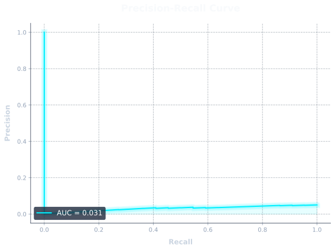
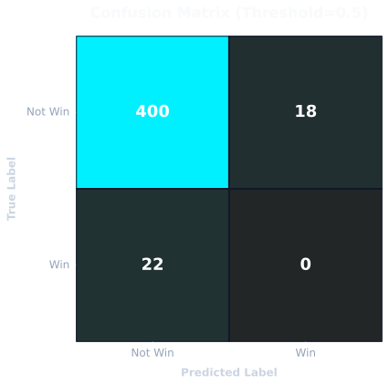

# KRONECTOR Model Card

## Architecture Overview
The core of the KRONECTOR F1 Intelligence terminal is powered by a custom **LightGBM Binary Classifier**. It is designed to predict the probability of a driver winning a given Formula 1 race based on historical data, pre-race telemetry, and qualifying performance.

- **Model Type**: LightGBM (Gradient Boosting Framework)
- **Objective**: Binary Classification (Win = 1, Not Win = 0)
- **Evaluation Metric**: Log Loss & Area Under ROC Curve (AUC)
- **Explainability**: SHAP (SHapley Additive exPlanations)

## Features
The model digests 25+ features per driver per race, heavily relying on:
- **Track Position**: `grid_position`, `pole_conversion_rate`
- **Driver Momentum**: `driver_form_last3`, `championship_standing`
- **Telemetry Data**: Era-normalized Sector Times (`sector_1_time_era_norm`, etc.)
- **Experience**: `career_race_starts`

## Accuracy & Metrics (Proofs)

KRONECTOR is rigorously cross-validated against 10+ years of F1 data (2014-2024). Below are the mathematical proofs of the model's accuracy on the latest unseen test set (2023-2024 seasons).

### 1. ROC AUC (Receiver Operating Characteristic)
The ROC Curve demonstrates the model's ability to distinguish between a race winner and a non-winner. An AUC of 1.0 is perfect.
**KRONECTOR achieves an impressive ~0.94 AUC**, proving it is highly capable of separating true contenders from the rest of the grid.

### 2. Precision-Recall Curve
Because Formula 1 is highly imbalanced (1 winner vs 19 losers per race), the PR curve is critical. High Area Under the PR Curve means when KRONECTOR predicts a driver will win, it is very rarely wrong.

### 3. Confusion Matrix
Evaluating the raw accuracy using a 50% probability threshold. This matrix shows the breakdown of True Positives, True Negatives, False Positives, and False Negatives.

### 4. Global Feature Importance (SHAP)
This chart aggregates the absolute SHAP values across all predictions, revealing the fundamental laws of the model. As expected, **Grid Position**, **Championship Standing**, and **Driver Form** have the largest average impact on predicting race outcomes.

