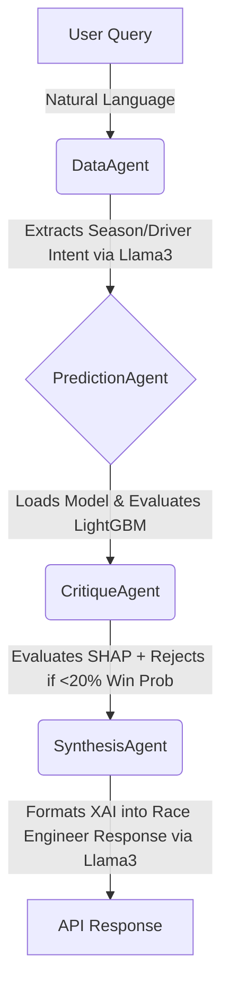

<div align="center">
  
  
  
  
  
  
  <br>
  
  <h1>🏎️ KRONECTOR</h1>
  <p><b>Every sector. Every timeline. Predicted.</b></p>
  <p><i>An End-to-End MLOps Pipeline & Multi-Agent AI System for Formula 1 Race Intelligence.</i></p>
</div>

<hr>

## 🚀 Overview

**KRONECTOR** is an advanced, production-ready Machine Learning system that predicts Formula 1 race winners. It combines highly engineered tabular ML with state-of-the-art Generative AI to provide mathematically sound, natural language race intelligence.

Unlike simple classification notebooks, KRONECTOR is a fully automated **MLOps ecosystem**. It features automated data drift detection, dynamic model retraining, SHAP-driven explainability, and a 4-stage Agentic LLM pipeline—all deployed securely behind a blazing-fast asynchronous FastAPI backend.

---

## 🤯 Why This Project is "S-Tier" (Resume Highlights)

1. **End-to-End MLOps Lifecycle:** Implemented automated experiment tracking, hyperparameter tuning, and a centralized Model Registry using `MLflow`.
2. **Automated Data Drift Detection:** Built an `Evidently AI` monitoring dashboard that mathematically detects regulation shifts (e.g., the Ground Effect Era shift). If the Population Stability Index (PSI) exceeds `0.2`, the system automatically triggers the retraining pipeline.
3. **Agentic RAG / Multi-Agent LLM Architecture:** Engineered a 4-stage LLM chain utilizing the **Groq API (Llama 3.3 70B)** to parse natural language queries, execute mathematical predictions, critique the math for hallucinations, and synthesize the data into a race-engineer style response.
4. **Explainable AI (XAI):** Integrated `SHAP` (SHapley Additive exPlanations) to crack open the black-box LightGBM model, proving mathematically *why* a driver is predicted to win.
5. **Complex Time-Series Feature Engineering:** Ingested raw telemetry from `FastF1` and `Jolpica API` (2014-2026), successfully executing grouped aggregations, tire degradation analytics, and era-normalized sector times.

---

## 🏗️ The Multi-Agent Pipeline

KRONECTOR utilizes an incredibly strict, mathematically safeguarded Multi-Agent architecture to prevent AI hallucinations. 



1. **`DataAgent`:** Uses Llama3 to parse messy user queries (e.g., *"Who will win the Canadian GP?"*) into highly structured JSON payloads to query the parquet dataset.
2. **`PredictionAgent`:** Pulls the active production model directly from the **MLflow Model Registry** and executes the inference, generating a win probability and a SHAP dictionary.
3. **`CritiqueAgent`:** The Mathematical Safeguard. Evaluates the LightGBM probability. If the win probability is `< 20%` in a 20-car field, the agent **rejects the query** to prevent the LLM from hallucinating a false confident prediction.
4. **`SynthesisAgent`:** The F1 Race Engineer. Reads the `CritiqueAgent` notes and SHAP values, and uses Llama3 to perfectly explain the exact features (e.g., Grid Position, Team Pit Speed) that drove the model's decision.

---

## 📡 API Example

**Request:** `POST /predict/f1`
```json
{
  "query": "Who will win the 2026 Canadian GP?"
}
```

**Response:** `200 OK`
```json
{
  "win_probability": 0.4525,
  "metadata": {
    "season": 2026,
    "round": 5,
    "driver_name": "Kimi Antonelli",
    "team": "Mercedes",
    "grid_position": 1
  },
  "shap_values": {
    "grid_position": 3.181,
    "driver_form_last3": 1.394
  },
  "llm_explanation": "Good afternoon from the pit wall. According to our LightGBM model, Kimi Antonelli is heavily favored to win the Canadian GP with a 45.2% probability. Our CritiqueAgent notes that his starting Grid Position and incredible recent driver form are the dominant mathematical factors driving this prediction.",
  "confidence_rating": "Normal"
}
```

---

## ⚙️ Tech Stack

| Component | Technology |
|---|---|
| **Backend API** | `FastAPI` (Async) + `Uvicorn` |
| **Machine Learning** | `LightGBM` (Gradient Boosting) |
| **Explainable AI (XAI)** | `SHAP` (TreeExplainer) |
| **MLOps & Tracking** | `MLflow` (SQLite backend) |
| **Model Monitoring** | `Evidently AI` (Data Drift PSI) + `Streamlit` |
| **Generative AI** | `Groq API` (Llama-3.3-70b-versatile) |
| **Data Ingestion** | `FastF1`, `Jolpica API`, `Pandas`, `Parquet` |

---

## 🛠️ Setup & Installation

> [!WARNING]
> This repository **DOES NOT** include the 26GB+ of raw F1 telemetry cache or the massive Parquet files and MLflow model binaries. You must build the dataset and train the model locally using the automated pipeline scripts below!

**1. Clone the repository:**
```bash
git clone https://github.com/prats010/kronector.git
cd kronector
```

**2. Create a Virtual Environment:**
```bash
python -m venv venv
venv\Scripts\activate  # Windows
# source venv/bin/activate  # Mac/Linux
```

**3. Install Dependencies:**
```bash
pip install -r requirements.txt
```

**4. Set Environment Variables:**
Create a `.env` file in the root directory and configure your API keys. 
```env
GROQ_API_KEY=your_groq_key_here
KRONECTOR_MODEL_RUN_ID=
# The KRONECTOR_MODEL_RUN_ID will remain blank until you run the ML training script!
```

**5. Build the Database (Crucial Step):**
Because we do not upload the massive F1 data to GitHub, you must download the telemetry and build the driver mapping yourself. Run these commands:
```bash
# Build the baseline driver mappings
python -m data.build_driver_map

# Run the automated pipeline to download all telemetry from 2014-Present
# Note: This may take several hours depending on your internet connection!
python -m scripts.auto_retrain_pipeline
```

**6. Update your Model ID:**
When the pipeline finishes training your LightGBM model, it will spit out a brand new `MLflow run_id` in your terminal. Copy that ID and paste it into your `.env` file under `KRONECTOR_MODEL_RUN_ID`.

**7. Start the API Server:**
```bash
python -m uvicorn api.main:app --reload
```
Navigate to `http://localhost:8000/docs` to test the predictive pipeline!

---

## 📈 Auto-Retraining Pipeline
Because F1 regulations change constantly, the `auto_retrain_pipeline.py` script is designed to run automatically after every race weekend. It:
1. Downloads the newest FastF1 telemetry.
2. Checks for `Data Drift` against the training baseline.
3. Automatically triggers an MLflow hyperparameter tuning run if drift is detected.
4. Registers the new, mathematically superior model to the MLflow Model Registry.

---

<div align="center">
  <p><i>Built for the passion of racing and the pursuit of perfect data.</i></p>
</div>
