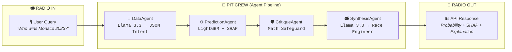
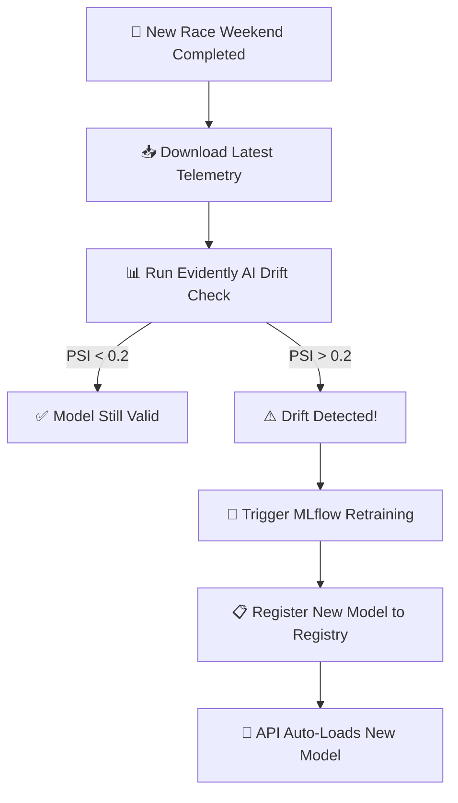

<div align="center">

<!-- Badges Row 1: Status -->


<br>

<!-- Badges Row 2: Tech -->


<br><br>

<!-- ASCII Art Header -->
```
██╗  ██╗██████╗  ██████╗ ███╗   ██╗███████╗ ██████╗████████╗ ██████╗ ██████╗ 
██║ ██╔╝██╔══██╗██╔═══██╗████╗  ██║██╔════╝██╔════╝╚══██╔══╝██╔═══██╗██╔══██╗
█████╔╝ ██████╔╝██║   ██║██╔██╗ ██║█████╗  ██║        ██║   ██║   ██║██████╔╝
██╔═██╗ ██╔══██╗██║   ██║██║╚██╗██║██╔══╝  ██║        ██║   ██║   ██║██╔══██╗
██║  ██╗██║  ██║╚██████╔╝██║ ╚████║███████╗╚██████╗   ██║   ╚██████╔╝██║  ██║
╚═╝  ╚═╝╚═╝  ╚═╝ ╚═════╝ ╚═╝  ╚═══╝╚══════╝ ╚═════╝   ╚═╝    ╚═════╝ ╚═╝  ╚═╝
```

<h3>🏎️ Every Sector. Every Timeline. Predicted.</h3>

<p><i>An End-to-End MLOps Pipeline & Multi-Agent AI System for Formula 1 Race Intelligence.</i></p>

<br>

**`📻 "Box Box Box... The AI has made its call."`**

</div>

---

## 🏁 What is KRONECTOR?

**KRONECTOR** is not a notebook. It's not a Kaggle submission. It's a **production-grade, self-healing Machine Learning system** that ingests 12 years of Formula 1 telemetry data, predicts race winners with mathematical precision, and explains its reasoning through a multi-agent LLM pipeline — all in natural language, like a race engineer talking to you over the radio.

```
📻 YOU:   "Who's going to win the Canadian GP?"
📻 KRON:  "Good afternoon from the pit wall. Our LightGBM model gives Kimi Antonelli 
           a 45.2% win probability. His Grid Position and driver form over the last 
           three races are the dominant mathematical factors. Confidence: Normal."
```

> **Think of it as:** ChatGPT meets an F1 Strategy Department — except every word is backed by SHAP-verified mathematics, not hallucinated opinions.

---

## 🔥 Why Recruiters Should Care

<table>
<tr>
<td width="60">🧠</td>
<td><b>End-to-End MLOps</b></td>
<td>Not just model training — full lifecycle with <code>MLflow</code> experiment tracking, model registry, hyperparameter tuning, and automated retraining triggers.</td>
</tr>
<tr>
<td>🤖</td>
<td><b>Multi-Agent LLM Architecture</b></td>
<td>4-stage agentic pipeline (<code>DataAgent → PredictionAgent → CritiqueAgent → SynthesisAgent</code>) using <b>Llama 3.3 70B</b> via Groq API. The agents have typed I/O contracts and mathematically reject hallucinations.</td>
</tr>
<tr>
<td>🔍</td>
<td><b>Explainable AI (XAI)</b></td>
<td><code>SHAP TreeExplainer</code> cracks open the black-box LightGBM model. Every prediction comes with a full breakdown of <i>why</i> — not just <i>what</i>.</td>
</tr>
<tr>
<td>📊</td>
<td><b>Automated Drift Detection</b></td>
<td><code>Evidently AI</code> monitors feature distributions across F1 regulation eras. When PSI > 0.2 on critical features, the system auto-triggers retraining. Senior ML Engineer territory.</td>
</tr>
<tr>
<td>⚡</td>
<td><b>Production API</b></td>
<td>Async <code>FastAPI</code> backend with CORS, health checks, Swagger docs, and global model state management. Not a prototype — deployment-ready.</td>
</tr>
<tr>
<td>🏗️</td>
<td><b>Complex Feature Engineering</b></td>
<td>12 seasons of raw telemetry (2014–2026) from <code>FastF1</code> + <code>Jolpica API</code>. Era-normalized sector times, tire degradation curves, safety car probabilities, and grouped aggregations.</td>
</tr>
</table>

---

## 🎥 Live Demos

### Swagger API Prediction
See the backend multi-agent pipeline in action via the interactive `/predict/f1` endpoint:

<video src="https://github.com/prats010/kronector/raw/main/assets/swagger_ui.mp4" controls="controls" muted="muted" style="max-width: 100%;"></video>

### Vercel App Prediction
See the frontend dashboard providing the win probability, AI insight, and SHAP key factors:


---

## 🏗️ The Pit Wall — Multi-Agent Architecture

Every prediction passes through a strict 4-agent pipeline. No shortcuts. No hallucinations.



| Agent | Role | Tech |
|-------|------|------|
| **🧠 DataAgent** | Parses natural language into structured `QueryIntent` (season, grand prix, driver). Resolves race names against the actual database — no hallucinated round numbers. | `Groq API` / `Llama 3.3 70B` |
| **⚙️ PredictionAgent** | Loads the production model from `MLflow Registry`, runs inference on the filtered DataFrame, generates win probability + full SHAP value dictionary. | `LightGBM` / `MLflow` / `SHAP` |
| **🛡️ CritiqueAgent** | The mathematical bouncer. Rejects predictions below 20% probability (random chance in a 20-car field). Flags overconfidence above 95%. Extracts top-3 SHAP driving factors. | Pure Python logic |
| **📻 SynthesisAgent** | Receives the approved math and speaks like an F1 race engineer. References exact feature names and SHAP magnitudes. Will **refuse** to generate a response if the CritiqueAgent rejected the prediction. | `Groq API` / `Llama 3.3 70B` |

---

## 📡 API — Talk to the Pit Wall

### `POST /predict/f1` — Ask anything about any race

**Request:**
```json
{
  "query": "Who will win the 2026 Canadian GP?"
}
```

**Response:**
```json
{
  "win_probability": 0.4525,
  "metadata": {
    "season": 2026,
    "round": 5,
    "driver_name": "Kimi Antonelli",
    "team": "Mercedes",
    "grid_position": 1
  },
  "shap_values": {
    "grid_position": 3.181,
    "championship_standing": 1.737,
    "driver_form_last3": 1.394,
    "team": 1.010,
    "avg_lap_time_practice": -1.755
  },
  "llm_explanation": "Good afternoon from the pit wall. Our LightGBM model gives 
    Kimi Antonelli a 45.2% win probability at the Canadian GP. The CritiqueAgent 
    confirms this is mathematically sound — his Grid Position (SHAP: +3.18) and 
    recent driver form (SHAP: +1.39) are the dominant positive factors.",
  "confidence_rating": "Normal"
}
```

### Other Endpoints

| Method | Endpoint | Description |
|--------|----------|-------------|
| `GET` | `/drivers?season=2026` | List all drivers on the grid for a season |
| `GET` | `/races/2026` | List all available races in a season |
| `GET` | `/health` | System health check (model loaded, data available) |
| `GET` | `/docs` | Interactive Swagger UI — test everything live |

---

## ⚙️ Tech Stack — The Power Unit

```
┌─────────────────────────────────────────────────────┐
│                    KRONECTOR v1.0                    │
├─────────────────────────────────────────────────────┤
│  🎙️  Natural Language Layer                         │
│      └─ Groq API (Llama-3.3-70b-versatile)          │
├─────────────────────────────────────────────────────┤
│  🔧  Agent Orchestration                            │
│      └─ DataAgent → PredictionAgent                 │
│         → CritiqueAgent → SynthesisAgent            │
├─────────────────────────────────────────────────────┤
│  ⚙️  ML Engine                                      │
│      ├─ LightGBM (Gradient Boosting Classifier)     │
│      ├─ SHAP TreeExplainer (Explainability)         │
│      └─ Evidently AI (Data Drift / PSI Monitoring)  │
├─────────────────────────────────────────────────────┤
│  📊  MLOps & Experiment Tracking                    │
│      ├─ MLflow (Model Registry + Artifact Store)    │
│      └─ TimeSeriesSplit (n=5, no data leakage)      │
├─────────────────────────────────────────────────────┤
│  🏎️  Data Ingestion                                 │
│      ├─ FastF1 (2018–2026 telemetry)                │
│      ├─ Jolpica API (2014–2017 historical)          │
│      └─ Apache Parquet (columnar storage)           │
├─────────────────────────────────────────────────────┤
│  🌐  API & Deployment                               │
│      ├─ FastAPI (async) + Uvicorn                   │
│      ├─ Streamlit (Drift Monitoring Dashboard)      │
│      └─ CORS-enabled for frontend integration       │
└─────────────────────────────────────────────────────┘
```

---

## 📁 Project Structure — The Garage

```
kronector/
├── agents/                     # 🤖 Multi-Agent LLM Pipeline
│   ├── data_agent.py           #    NLP intent extraction (Llama 3.3)
│   ├── prediction_agent.py     #    Model inference orchestrator
│   ├── critique_agent.py       #    Mathematical safeguard & SHAP ranker
│   └── synthesis_agent.py      #    Race engineer response generator
│
├── api/                        # 🌐 FastAPI Backend
│   ├── main.py                 #    Endpoints, lifespan, global state
│   └── schemas.py              #    Pydantic request/response models
│
├── ml/                         # ⚙️ Machine Learning Core
│   ├── train.py                #    LightGBM training + MLflow logging
│   ├── predict.py              #    Inference + SHAP explanation
│   ├── feature_engineering.py  #    Era normalization, encoders, features
│   └── drift_detection.py      #    Evidently AI PSI monitoring
│
├── data/                       # 🏎️ Data Pipelines
│   ├── fastf1_pipeline.py      #    FastF1 telemetry ingestion (2018-2026)
│   ├── jolpica_pipeline.py     #    Jolpica API historical data (2014-2017)
│   └── build_driver_map.py     #    Canonical driver ID mapping
│
├── scripts/                    # 🔁 Automation
│   └── auto_retrain_pipeline.py#    Full pipeline: ingest → drift → retrain
│
├── ui/                         # 📊 Monitoring
│   ├── monitoring_dashboard.py #    Streamlit drift dashboard
│   └── drift_report.html       #    Evidently HTML report
│
├── tests/                      # 🧪 Test Suite
│   ├── test_data_agent.py
│   ├── test_predict.py
│   ├── test_feature_engineering.py
│   └── ...
│
├── .env                        # 🔑 API keys (git-ignored)
├── .gitignore                  # 🚫 Blocks 26GB+ cache from upload
├── requirements.txt            # 📦 All dependencies
└── README.md                   # 📖 You are here
```

---

## 🛠️ Setup & Installation — Pre-Race Checklist

> [!WARNING]
> This repository **DOES NOT** include the 26GB+ of raw F1 telemetry cache, the Parquet datasets, or MLflow model binaries. You must build everything locally using the automated pipeline scripts below. This is by design — we don't want GitHub to explode.

### Step 1: Clone the Repo
```bash
git clone https://github.com/prats010/kronector.git
cd kronector
```

### Step 2: Create Virtual Environment
```bash
python -m venv venv
venv\Scripts\activate        # Windows
# source venv/bin/activate   # Mac/Linux
```

### Step 3: Install Dependencies
```bash
pip install -r requirements.txt
```

### Step 4: Configure Environment
Create a `.env` file in the project root:
```env
GROQ_API_KEY=your_groq_api_key_here
KRONECTOR_MODEL_RUN_ID=
# ↑ Leave blank for now. You'll get this after training the model.
```

> [!NOTE]
> Get a free Groq API key at [console.groq.com](https://console.groq.com). The `KRONECTOR_MODEL_RUN_ID` will be generated automatically when you run the training pipeline.

### Step 5: Build the Dataset (The Long Stint)
```bash
# Build the canonical driver ID mappings
python -m data.build_driver_map

# Run the full automated pipeline: download telemetry → engineer features → train model
# ☕ This downloads 12 seasons of F1 data. Go grab a coffee.
python -m scripts.auto_retrain_pipeline
```

### Step 6: Update Your Model ID
When training completes, the terminal will output an MLflow `run_id`. Copy it and paste it into your `.env`:
```env
KRONECTOR_MODEL_RUN_ID=your_new_run_id_here
```

### Step 7: Lights Out 🟢🟢🟢🟢🟢
```bash
python -m uvicorn api.main:app --reload
```

Navigate to **[http://localhost:8000/docs](http://localhost:8000/docs)** and start asking questions!

---

## 📈 Auto-Retraining Pipeline — Keeping the Car Competitive

F1 regulations change. Cars evolve. Drivers switch teams. A model trained on 2023 data will drift when 2026 arrives.

KRONECTOR handles this automatically:



The `auto_retrain_pipeline.py` script:
1. 📥 Downloads the newest FastF1 telemetry
2. 📊 Runs an `Evidently AI` drift check against the training baseline
3. 🔧 Auto-triggers `MLflow` hyperparameter tuning if PSI exceeds `0.2`
4. 📋 Registers the mathematically superior model to the MLflow Model Registry

---

## 🧠 Key Design Decisions

| Decision | Rationale |
|----------|-----------|
| **`TimeSeriesSplit(n=5)`** | Never random split, never shuffle. F1 data is temporal — future data must never leak into training. |
| **Era-normalized sector times** | Sector times are normalized *within* regulation eras (V6 Hybrid, Ground Effect, etc.), not globally. A 2014 lap time is meaningless compared to 2024. |
| **Binary Classification** | The model predicts `P(win)` — a binary outcome. Predicting exact finishing positions (1st through 20th) would require ordinal regression and is astronomically harder due to midfield chaos. |
| **20% rejection threshold** | In a 20-car field, random chance is 5%. Below 20%, the model is essentially guessing. The CritiqueAgent kills the prediction to prevent the LLM from fabricating confidence. |
| **Grand Prix name matching** | The DataAgent resolves race names (e.g., "Canadian GP") against the actual database instead of relying on the LLM to guess round numbers. No more hallucinated "Round 9" errors. |

---

## 👨‍💻 About the Author

**Prathamesh Anil Bhamare**  
*MSc Computer Science Student*

Built with a passion for Data Science, Artificial Intelligence, and the relentless pursuit of perfect race strategy.

[](https://github.com/prats010)

---

<div align="center">
<br>

```
📻 "And that's P1! KRONECTOR takes the chequered flag!" 🏁
```

<br>

<sub>Built for the passion of racing and the pursuit of perfect data.</sub>

</div>


## Model Metrics & Proofs

Check out the [Model Card & Accuracy Proofs](MODEL_CARD.md) for ROC AUC, PR, and SHAP metrics.
