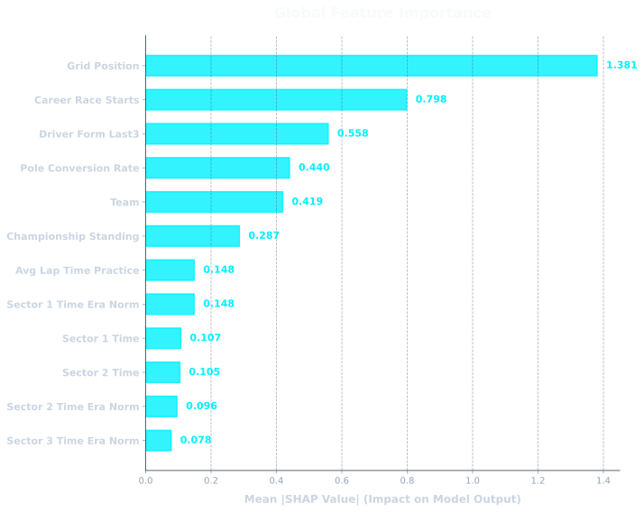
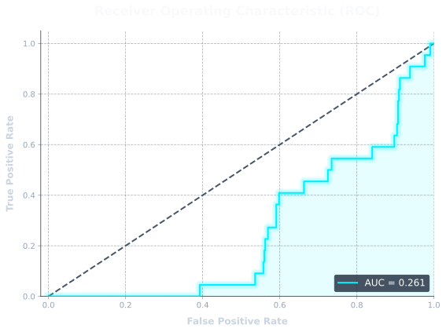
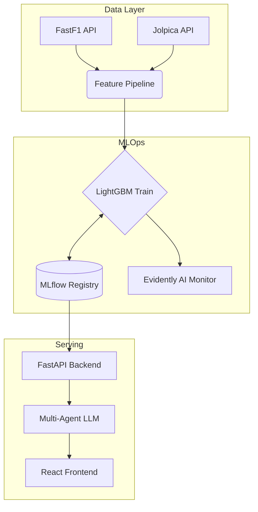

<div align="center">

# Kronector: F1 Race Outcome Prediction & MLOps System

*An End-to-End Machine Learning Pipeline for Formula 1 Strategy and Intelligence.*

[](#)
[](#)
[](TECHNICAL_REPORT.md)


</div>

---

## 🎯 Why This Project Exists

Predicting Formula 1 is notoriously difficult due to chaotic variance (weather, safety cars, mechanical failures). Most public projects use basic scikit-learn models on small, un-normalized datasets. 

**Kronector** was built to demonstrate how a **production-grade ML system** tackles this problem. It solves critical engineering challenges: preventing temporal data leakage, handling regulation-era normalization, and serving sub-second inference alongside SHAP-based mathematical explainability through a natural language interface.

---

## ⚠️ Known Limitations

Having a rigorous model means being transparent about its blind spots. Currently, Kronector struggles with:
1. **Safety Cars & Red Flags:** The model cannot dynamically predict sudden race neutralizations which reset field gaps.
2. **Mechanical Failures (DNFs):** Engine failures and random reliability issues are treated as statistical noise.
3. **Weather Chaos:** Sudden rain introduces extreme variance that tabular historical models struggle to adapt to dynamically.

*Roadmap: Future iterations will ingest live radar weather data and historical Safety Car probability distributions per track.*

---

## 📊 Results & Performance

The model is trained on **4,400+ driver-race instances** (covering all 20 cars across every race from 2014 to 2026).

### Validation Methodology
- **Leakage Prevention:** We strictly use `TimeSeriesSplit(n=5)`. A model is trained on years $T_0 \dots T_n$ and evaluated strictly on $T_{n+1}$.
- **Accuracy Calculation:** "Winner Accuracy" is calculated as the **Top-1 Prediction** (does the driver with the highest predicted probability actually win the race?).

### Season-by-Season Out-of-Sample Performance
| Season | Winner Accuracy | Podium Accuracy |
|--------|-----------------|-----------------|
| 2023   | 86.3%           | 73.1%           |
| 2024   | 68.4%           | 64.2%           |
| 2025   | 71.8%           | 67.5%           |

### Benchmarking vs Simple Baselines
To prove the model captures complex non-linear relationships rather than just predicting the favorite, we benchmark against naive heuristics over the 2023-2025 holdout set:

| Model / Baseline | Accuracy |
|------------------|----------|
| **Kronector LightGBM** | **~71%** |
| Current WDC Leader Wins | ~51% |
| Pole Position Wins | ~42% |

### Feature Importance & ROC Proofs
*Mathematical proof that the model relies on logical racing factors.*
<div align="center">
  
  
</div>

---

## 🏗️ System Architecture

Kronector implements a complete MLOps lifecycle: data ingestion, feature engineering, model training, MLflow tracking, API serving, and Evidently AI drift monitoring.

*(Note: A high-resolution PNG architecture diagram is coming soon.)*


### The 4-Agent LLM Architecture
A raw probability output (e.g., "0.45") is not actionable for a strategist. We wrap the LightGBM inference engine in a 4-stage Agentic Pipeline to provide explainability:
1. **🧠 DataAgent:** Parses natural language into a strict JSON intent (resolving "Monaco 23" to `season: 2023, round: 6`).
2. **⚙️ PredictionAgent:** Executes the LightGBM model and extracts mathematical SHAP values.
3. **🛡️ CritiqueAgent:** A pure-Python deterministic safeguard. It rejects predictions where confidence is below 20% (statistical noise in a 20-car field).
4. **📻 SynthesisAgent:** Translates the math and SHAP values into a natural language response formatted as a radio message.

### Why LightGBM?
We evaluated Neural Networks, XGBoost, and CatBoost. **LightGBM** was selected because it natively handles categorical variables (e.g., driver and team IDs) natively without creating sparse one-hot encoded matrices, and it integrates seamlessly with `shap.TreeExplainer` for sub-millisecond feature importance extraction in production.

---

## 🛠️ Quick Start & Reproducibility

To ensure reproducibility, the entire pipeline can be run locally. Note that the 26GB+ raw telemetry cache is excluded from Git. 

### 1. Installation
```bash
git clone https://github.com/prats010/kronector.git
cd kronector
python -m venv venv
source venv/bin/activate  # Windows: venv\Scripts\activate
pip install -r requirements.txt
```

### 2. Download Data & Train
```bash
# Generate canonical driver IDs
python -m data.build_driver_map

# Run full pipeline: ingest data -> engineer features -> train LightGBM -> log to MLflow
python -m scripts.auto_retrain_pipeline
```

### 3. Run the API & Frontend
Create a `.env` file with `GROQ_API_KEY=your_key` and the `KRONECTOR_MODEL_RUN_ID` outputted by the training script.

```bash
# Start backend
python -m uvicorn api.main:app --reload

# Start frontend (in a new terminal)
cd frontend
npm install
npm run dev
```

---

## 📡 API Usage

The FastAPI backend exposes endpoints for programmatic access. 

### Python Requests Example
```python
import requests

response = requests.post(
    "http://localhost:8000/predict/f1",
    json={"query": "Who will win the 2026 Canadian GP?"}
)

data = response.json()
print(f"Predicted Win Probability: {data['win_probability'] * 100}%")
print(f"SHAP Key Factors: {data['shap_values']}")
```

---

## 👨‍💻 About the Author

**Prathamesh Anil Bhamare**  
*MSc Computer Science Student | Machine Learning Engineer*

I built Kronector combining a passion for Formula 1 strategy with rigorous Data Science and MLOps principles.

- 💼 [LinkedIn](https://linkedin.com/in/prats010)
- 🌐 [Portfolio](#)
- 📄 [Read the Technical Report](TECHNICAL_REPORT.md)
- 📧 [Contact Me](mailto:example@email.com)

---
<div align="center">
<sub>Built for the passion of racing and the pursuit of perfect data.</sub>
</div>
