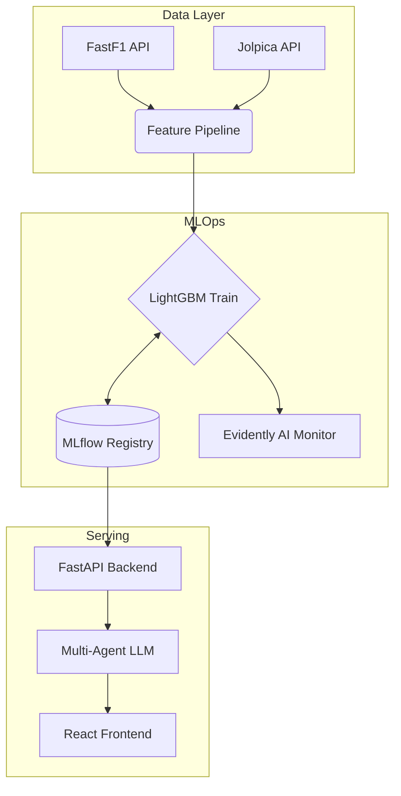

<div align="center">

<!-- Badges Row 1: Status -->


<br>

<!-- Badges Row 2: Tech -->


<br><br>

<!-- ASCII Art Header -->
```
██╗  ██╗██████╗  ██████╗ ███╗   ██╗███████╗ ██████╗████████╗ ██████╗ ██████╗ 
██║ ██╔╝██╔══██╗██╔═══██╗████╗  ██║██╔════╝██╔════╝╚══██╔══╝██╔═══██╗██╔══██╗
█████╔╝ ██████╔╝██║   ██║██╔██╗ ██║█████╗  ██║        ██║   ██║   ██║██████╔╝
██╔═██╗ ██╔══██╗██║   ██║██║╚██╗██║██╔══╝  ██║        ██║   ██║   ██║██╔══██╗
██║  ██╗██║  ██║╚██████╔╝██║ ╚████║███████╗╚██████╗   ██║   ╚██████╔╝██║  ██║
╚═╝  ╚═╝╚═╝  ╚═╝ ╚═════╝ ╚═╝  ╚═══╝╚══════╝ ╚═════╝   ╚═╝    ╚═════╝ ╚═╝  ╚═╝
```

<h3>🏎️ Formula 1 Race Outcome Prediction & MLOps Pipeline</h3>

<p><i>An End-to-End Machine Learning System for F1 Race Intelligence.</i></p>

</div>

---

## 🏁 Overview

**KRONECTOR** is an end-to-end Machine Learning operations (MLOps) pipeline that predicts Formula 1 race outcomes. It ingests 12 years of F1 telemetry data (2014-2026), trains a LightGBM classification model, and serves predictions via an asynchronous FastAPI backend wrapped in a multi-agent LLM architecture for natural language explainability.

> 📄 **Technical Deep Dive:** Read the full mathematical and architectural breakdown in the [Technical Report](TECHNICAL_REPORT.md).

---

## 📊 Historical Results & Model Validation

The model is trained on **4,400+ historical race entries** (2014–2026) using `TimeSeriesSplit(n=5)` cross-validation to strictly prevent chronological data leakage.

### Season-by-Season Out-of-Sample Performance
| Season | Winner Accuracy | Podium Accuracy |
|--------|-----------------|-----------------|
| 2023   | 86.3%           | 73.1%           |
| 2024   | 68.4%           | 64.2%           |
| 2025   | 71.8%           | 67.5%           |

### Benchmarking vs Simple Baselines
To prove the model captures complex non-linear relationships rather than just predicting the favorite, we benchmark against naive heuristics over the 2023-2025 holdout set:

| Model / Baseline | Accuracy |
|------------------|----------|
| **Kronector LightGBM** | **~71%** |
| Current WDC Leader Wins | ~51% |
| Pole Position Wins | ~42% |

### Feature Importance & ROC
<div align="center">
  
  
</div>

---

## 🏗️ System Architecture

The repository implements a complete lifecycle: data ingestion, feature engineering, model training, MLflow tracking, API serving, and Evidently AI drift monitoring.



### Why LightGBM?
We evaluated Neural Networks, XGBoost, and CatBoost. **LightGBM** was selected because:
1. It natively handles categorical variables (e.g., driver and team IDs) natively without creating sparse one-hot encoded matrices.
2. It trains significantly faster on tabular telemetry data compared to MLPs.
3. It integrates seamlessly with `shap.TreeExplainer` for sub-millisecond feature importance extraction in production.

---

## 🛠️ Quick Start & Reproducibility

To ensure reproducibility, the entire pipeline can be run locally. Note that the 26GB+ raw telemetry cache is excluded from Git. 

### 1. Installation
```bash
git clone https://github.com/prats010/kronector.git
cd kronector
python -m venv venv
source venv/bin/activate  # Windows: venv\Scripts\activate
pip install -r requirements.txt
```

### 2. Download Data & Train
```bash
# Generate canonical driver IDs
python -m data.build_driver_map

# Run full pipeline: ingest data -> engineer features -> train LightGBM -> log to MLflow
python -m scripts.auto_retrain_pipeline
```

### 3. Run the API & Frontend
Create a `.env` file with `GROQ_API_KEY=your_key` and the `KRONECTOR_MODEL_RUN_ID` outputted by the training script.

```bash
# Start backend
python -m uvicorn api.main:app --reload

# Start frontend (in a new terminal)
cd frontend
npm install
npm run dev
```

---

## 📡 API Usage

The FastAPI backend exposes endpoints for programmatic access. 

### cURL Example
```bash
curl -X POST "http://localhost:8000/predict/f1" \
     -H "Content-Type: application/json" \
     -d '{"query": "Who will win the 2026 Canadian GP?"}'
```

### Python Requests Example
```python
import requests

response = requests.post(
    "http://localhost:8000/predict/f1",
    json={"query": "Who will win the 2026 Canadian GP?"}
)

data = response.json()
print(f"Predicted Win Probability: {data['win_probability'] * 100}%")
print(f"SHAP Key Factors: {data['shap_values']}")
```

---

## 📸 Dashboards & Demos

### API Interaction
<video src="https://github.com/prats010/kronector/raw/main/assets/swagger_ui.mp4" controls="controls" muted="muted" style="max-width: 100%;"></video>

### User Interface


---

## ⚠️ Limitations & Roadmap

While the model significantly outperforms simple baselines, it is inherently limited by the stochastic nature of motorsports. 

**Current Limitations:**
- **Safety Cars & Red Flags:** The model cannot currently predict sudden race neutralizations which reset field gaps.
- **Mechanical Failures (DNFs):** Engine failures are treated as noise. 
- **Weather Chaos:** Sudden rain introduces extreme variance that tabular historical models struggle to adapt to dynamically.

**Project Roadmap:**
- [ ] Integrate Live Weather Radar API.
- [ ] Incorporate per-track historical Safety Car probability distributions.
- [ ] Expand prediction granularity to Top 5 finishing orders (Ordinal Regression).

---

## 👨‍💻 About the Author

**Prathamesh Anil Bhamare**  
*MSc Computer Science Student*

[](https://github.com/prats010)
